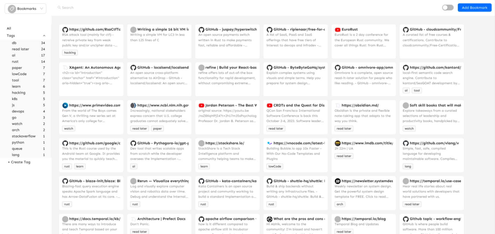
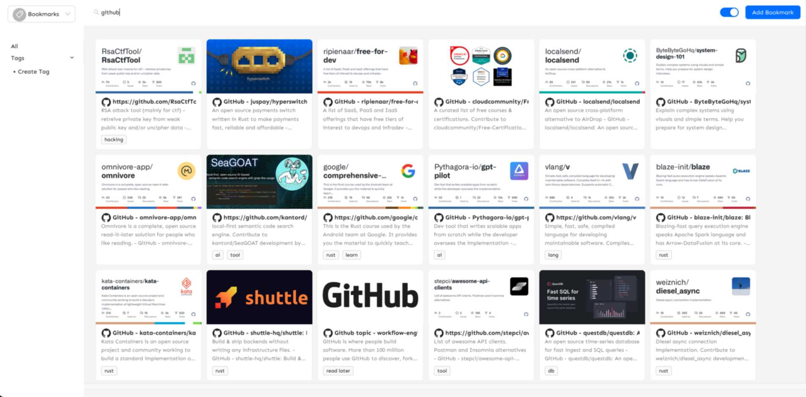
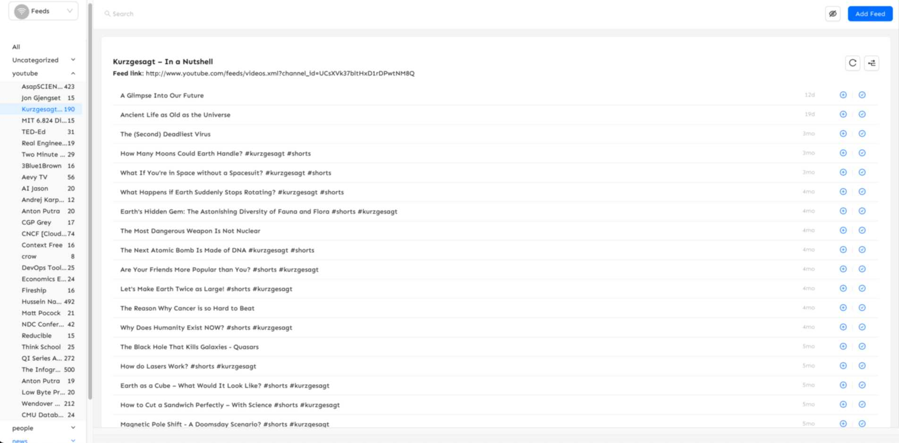

# Cave 
My personal bookmark manager and rss reader.  
Stores all the bookmarks and feed onto a sqlite database in my dropbox folder.

### Libraries used. 
- [Next.js](https://nextjs.org)
- [NextAuth.js](https://next-auth.js.org)
- [Prisma](https://prisma.io)
- [Tailwind CSS](https://tailwindcss.com)
- [tRPC](https://trpc.io)

### Configuration  
See `.env.example` file

### Features
* Rss Reader
 * Youtube parser: Can accept youtube urls. Also get videos from the official youtube api (Requires a youtube api key)
* Bookmark manager

### Screenshots

